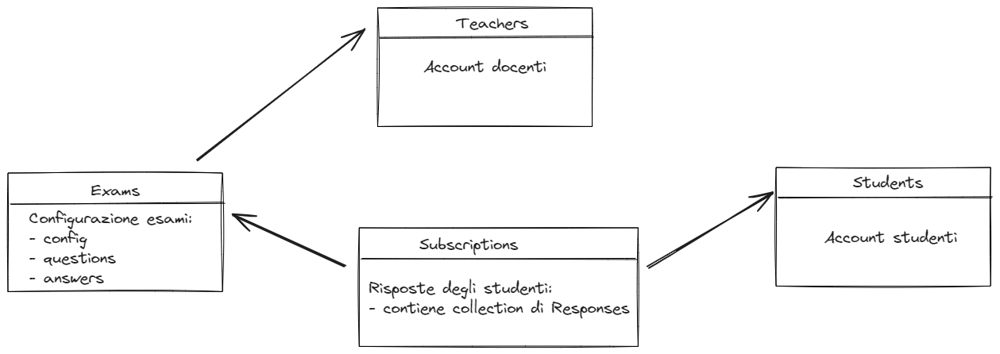

# Modellazione dei dati

Il database (MongoDB) contiene 4 collections:

- **Teachers**: account degli insegnanti
- **Students**: account degli studenti
- **Exams**: elenco degli esami. Ogni esame contiene tutta la struttura dati necessaria: configurazione, domande e risposte
- **Session**: elenco delle sessioni, ogni sessione è collegata a un esame e a una classe. Contiene anche la data di svolgimento della sessione
- **Subscriptions**: elenco dei delle prove d'esame svolte dagli studenti. Ogni subscription contiene tutti i dati della prova: risposte date, azioni di disturbo compiute, domande al docente, ecc.
