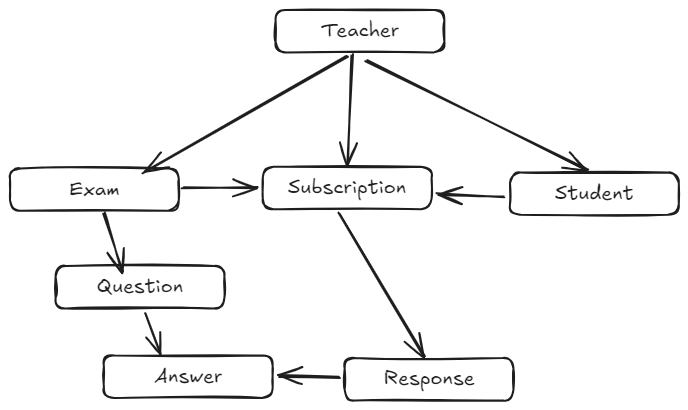

# Domain model

In questo schema si visualizza in modo semplificato la connessione logica tra le entità del sistema:

- il docente (Teacher) gestisce Esamx, Subscriptions e Students
- un Exam contiene domande (Question), ciascuna delle quali contiene un elenco di possibili risposte (Answer) 
- lo studente può partecipare a un Exam tramite una Subscription
- Le risposte dello studente (Response) sono collegate logicamente alla Subscription e a una Answer
