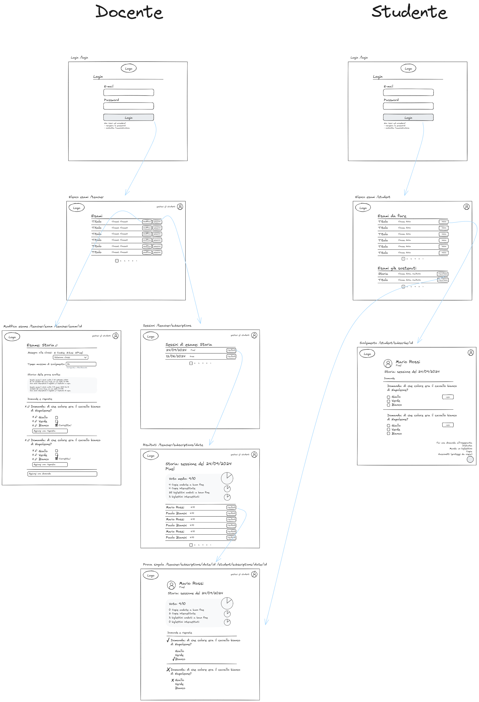

# Exgame - requisiti

## Obiettivi

Si intende realizzare un'applicazione web per svolgere esami o quiz, simulando l'esperienza di un esame in aula o di un compito in classe, con l'aggiunta di un po' di divertimento. In questa applicazione, infatti, si possono verificare alcune delle condizioni più tipiche di un esame in presenza, come ad esempio:

- uno studente cerca di copiare
- un compagno non ti lascia copiare
- qualcuno disturba in aula
- si possono fare domande al docente, che risponde a tutta la classe

## Requisiti funzionali

Gli attori del sistema sono docenti, studenti e admin. I primi fungono da amministratori e i secondi da utenti registrati. Admin è un utente con tutti i diritti di un docente, più la possibilità di gestire tutte le entità del sistema. L'admin può anche registrare nuovi utenti e "promuovere" uno studente al ruolo di docente (questo perché tutti gli utenti che si registrano autonomamente vengono inizialmente inseriti come studenti).

### User stories

Come Admin voglio:

- Registrare account per studenti e docenti
- Cambiare il ruolo di un account (es: uno Studente viene "promosso" a Docente)

Come Docente voglio:

- Registrare il mio account
- Cambiare la password
- Recuperare la password
- Creare gli account per gli Studenti
- Assegnare una classe a uno o più Studenti
- Registrare gli studenti agli esami, in modo che possano partecipare agli esami che ho preparato per loro
- Creare nuovi esami e modificarli:
  - aggiungere domande
  - aggiungere risposte
  - contrassegnare le risposte corrette
  - impostare il numero di "copie" ammesse per ogni studente
  - impostare il numero di "blocco copia" ammesso per ogni studente
  - configurare il numero di azioni di disturbo ammesse per ogni studente
  - permettere allo studente di farsi suggerire le risposte esatte dal sistema (configurabile nel numero di volte che lo studente può utilizzare questa opzione, anche zero è ammesso)
  - descrivere domande "aperte", senza Answer, a cui lo studente risponderà inserendo un testo libero. Queste domande saranno escluse dal calcolo automatico del voto, e permetteranno al docente di "correggere" la valutazione automatica
- Iniziare e terminare una sessione di esame
- Durante lo svolgimento, voglio poter rispondere alle domande degli studenti
- Visualizzare i risultati di ogni singolo studente
- Visualizzare un report dei risultati della classe, per avere una visione di insieme di com'è andata la prova d'esame

Come Studente voglio:

- Registrare il mio account
- Cambiare la password
- Recuperare la password
- Accedere al sistema
- Visualizzare gli esami a cui devo partecipare e quelli che ho già sostenuto
- Partecipare a un esame
  - Rispondere alle domande
  - Copiare da un compagno
  - Attivare la funzione "blocca copia" (bloccherà solo alcuni studenti random)
  - Disturbare la classe (eventualmente scegliendo tra diversi tipi di disturbo)
  - Fare domande al docente
  - Chiedere al sistema di suggerire la risposta corretta
  - Mandare un bigliettino a un compagno. I bigliettini rischieranno però di essere "intercettati" dal sistema. Ogni bigliettino intercettato comporta una penalizzazione per lo studente che lo invia
- Visualizzare l'esito della mia prova

### Diagramma degli use cases

### Wireframes

Puoi visualizzarli (e modificarli) anche usando [Excalidraw](https://excalidraw.com/), trovi il file sorgente [negli assets](./assets/wireframes.excalidraw).

## Requisiti tecnici

L'applicazione sarà sviluppata in Node.js, React e un database MongoDB.

Parallelamente, verrà sviluppato un piccolo sito di presentazione utilizzando Next.js.
